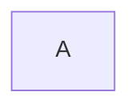

*This project has been created by Fcretin,Samaouch,Ale-guel.*
<!-- These are comments for my custom fonts and icons. -->
<!-- 𝔸 𝔹 ℂ 𝔻 𝔼 𝔽 𝔾 ℍ 𝕀 𝕁 𝕂 𝕃 𝕄 ℕ 𝕆 ℙ ℚ ℝ 𝕊 𝕋 𝕌 𝕍 𝕎 𝕏 𝕐 ℤ -->
<!-- 𝕒 𝕓 𝕔 𝕕 𝕖 𝕗 𝕘 𝕙 𝕚 𝕛 𝕜 𝕝 𝕞 𝕟 𝕠 𝕡 𝕢 𝕣 𝕤 𝕥 𝕦 𝕧 𝕨 𝕩 𝕪 𝕫  -->
<!-- 𝟘 𝟙 𝟚 𝟛 𝟜 𝟝 𝟞 𝟟 𝟠 𝟡 -->
<!-- 📘 🗎 🖋 👀 🗣 … -->
<!-- Double-struck font -->
<!-- 𝔸𝔹ℂ𝔻𝔼𝔽𝔾ℍ𝕀𝕁𝕂𝕃𝕄ℕ𝕆ℙℚℝ𝕊𝕋𝕌𝕍𝕎𝕏𝕐ℤ𝕒𝕓𝕔𝕕𝕖𝕗𝕘𝕙𝕚𝕛𝕜𝕝𝕞𝕟𝕠𝕡𝕢𝕣𝕤𝕥𝕦𝕧𝕨𝕩𝕪𝕫𝟘𝟙𝟚𝟛𝟜𝟝𝟞𝟟𝟠𝟡 -->

<!-- [Tag-test]: url "on hover" -->
[tag_icon_md]: https://skillicons.dev/icons?i=md

# ![][tag_icon_md] Markdown ![][tag_icon_md]

<br>

<details>
	<summary>
		<h1>𝕊ommaire</h1>
	</summary>
<blockquote>

- [𝕋itles](#head)
- [𝔽ormat](#format)
	- [Emphasize an element](#emphasize)
    - [Quotes/Layout](#quotes)
    - [Code block](#code-block)
    - [Lists](#list)
    - [Color](#color)
- [𝕋ables](#tables)
    - [Basic syntax](#basic)
    - [Simplified syntax](#simp)
    - [Content alignment](#align)
    - [Cells with long text](#text)
    - [Escaping the pipe](#pipe)
- [𝕃inks](#link)
    - [External links](#external)
    - [Internal links](#internal)
    - [Images](#img)
- [ℂharts/𝔾raphs](#graph)
    - [Nodes/Boxes](#node)
    - [Lines/Edges](#line)
    - [Modify the style](#style)
	- [Advanced usage](#advanced)
</blockquote>
</details>

---

<details id= "head">
	<summary>
		<h2>𝕋itles</h2>
	</summary>

<blockquote>

Markdown supports six heading levels, defined by the number of # symbols before the text.

<ul>
<details>
	<summary>
		<strong>👀 𝕍isual</strong>
	</summary>
<br>

><h1 id="add id" >First-level heading (with id)</h1>
<br>

># First-level heading
>## Second-level heading
>### Third-level heading
>#### Fourth-level heading
>##### Fifth-level heading
>###### Sixth-level heading

</details>

<details>
	<summary>
		<strong>🗣 𝔼xplain</strong>
	</summary>

<br>

```
<h1 id="add id" >First-level heading</h1>

# First-level heading
## Second-level heading
### Third-level heading
#### Fourth-level heading
##### Fifth-level heading
###### Sixth-level heading
``` 
</ul>
</blockquote>
</details>
</details>

---


<details id= "format">
	<summary>
		<h2>𝔽ormat</h2>
	</summary>
<blockquote>
<br>

<dl><dd>
<details id= "emphasize">
	<summary>
		<h3>Emphasize an element</h3>
	</summary> 
<blockquote>

### <ins>Italics</ins>[^Italics]

[^Italics]: There are 4 ways to italicize text:   
	" \_Text_ "  
	" \*Text* "  
	" \<i>Text\</i> "   
	" \<em>Text\</em> "  
<dl><dd>
<details>
	<summary>
		<strong>👀 𝕍isual</strong>
	</summary>
<br>

>*This text is in italics*

</details>
<details>
	<summary>
		<strong>🗣 𝔼xplain</strong>
	</summary>

<br>

```
*This text is in italics*
```

</details>
</dd></dl>

### <ins>Bold</ins>
<dl><dd>
<details>
	<summary>
		<strong>👀 𝕍isual</strong>
	</summary>
<br>

>**This text is in bold**

</details>

<details>
	<summary>
		<strong>🗣 𝔼xplain</strong>
	</summary>

<br>

```
**This text is in bold**
```

</details>
</dd></dl>

### <ins>Bold and italics</ins>
<dl><dd>

<details>
	<summary>
		<strong>👀 𝕍isual</strong>
	</summary>
<br>

>***This text is in bold and italics***

</details>

<details>
	<summary>
		<strong>🗣 𝔼xplain</strong>
	</summary>

```
***This text is in bold and italics***
```

</details>
</dd></dl>


### <ins>Strikethrough</ins>[^Strikethrough]
[^Strikethrough]: There are 5 ways to strikethrough text:  
	" \~Text~ "  
	" \~~Text~~ "  
	" \<s>Text\</s> "  
	" \<strike>Text\</strike> "  
	" \<del>Text\</del> "  
<dl><dd>
<details>
	<summary>
		<strong>👀 𝕍isual</strong>
	</summary>
<br>

>~~Strikethrough text~~

</details>

<details>
	<summary>
		<strong>🗣 𝔼xplain</strong>
	</summary>

```
~~Strikethrough text~~
```

</details>
</dd></dl>


### <ins>Underline</ins>
<dl><dd>
<details>
	<summary>
		<strong>👀 𝕍isual</strong>
	</summary>
<br>

><ins>This text is underlined</ins>

</details>

<details>
	<summary>
		<strong>🗣 𝔼xplain</strong>
	</summary>

```
<ins>This text is underlined</ins>
```

</details>
</dd></dl>

### <ins>Bold and Search Engine Optimization</ins>
<dl><dd>
<details>
	<summary>
		<strong>👀 𝕍isual</strong>
	</summary>
<br>

><strong>This text is bolded and SEO-optimized.</strong>

</details>

<details>
	<summary>
		<strong>🗣 𝔼xplain</strong>
	</summary>

```
<strong>This text is bolded and SEO-optimized.</strong>
```
</dd></dl>

</details>

<details id="quotes">
	<summary>
	<h3>Quotes/Layout</h3>
	</summary>

<blockquote>

### <ins>Simple</ins>
<dl><dd>

<details>
	<summary>
		<strong>👀 Visual</strong>
	</summary>
<br>

> This is a simple blockquote.

</details>

<details>
	<summary>
		<strong>🗣 𝔼xplain</strong>
	</summary>

```
> This is a simple blockquote.
```

</details>
</dd></dl>

### <ins>Blockquote with multiple paragraphs</ins>
<dl><dd>
<details>
	<summary>
		<strong>👀 Visual</strong>
	</summary>

> This is the first paragraph.
>
> This is the second paragraph.

</details>

<details>
	<summary>
		<strong>🗣 𝔼xplain</strong>
	</summary>

```
> This is the first paragraph.
>
> This is the second paragraph.
```

</details>
</dd></dl>

### <ins>Nested blockquotes</ins>
<dl><dd>

<details>
	<summary>
		<strong>👀 Visual</strong>
	</summary>

> This is the main quote.
>
>> This is a nested quote.
>
> This is a nested quote.
>
>> This is a nested quote.

</details>

<details>
	<summary>
		<strong>🗣 𝔼xplain</strong>
	</summary>

```
> This is the main quote.
>
>> This is a nested quote.
>
> This is a nested quote.
>
>> This is a nested quote.
```

</details>
</dd></dl>


### <ins>Blockquote containing other elements</ins>
<dl><dd>

Blockquotes can contain other Markdown-formatted elements.Not all elements are compatible; some trial and error may be required to see what works.

<details>
	<summary>
		<strong>👀 Visual</strong>
	</summary>

> ## My shopping list
>
>- Tomato
>- Carrot
>- Potato
>	- For the raclette

</details>

<details>
	<summary>
		<strong>🗣 𝔼xplain</strong>
	</summary>

```
> ## My shopping list
>
>- Tomato
>- Carrot
>- Potato
>	- For the raclette
```

</details>
</details>
</dd></dl>
<dl><dd>

<details id="code-block">
	<summary>
	<h3>Code block</h3>
	</summary>

<blockquote>
<dl><dd>
<details>
	<summary>
		<strong>👀 Visual</strong>
	</summary>

```C
int nb = 0;
char c = 'c';
```

</details>

<details>
	<summary>
		<strong>🗣 𝔼xplain</strong>
	</summary>

>\```c  
int nb = 0;  
char c = 'c';  
>\```

</details>
</details>
</dd></dl>

<dl><dd>
<details id= "list">
	<summary>
		<h3>Lists</h3>
	</summary>

<blockquote>

### <ins>Ordered Lists</ins>

<dl><dd>
<details>
	<summary>
		<strong>👀 Visual</strong>
	</summary>

<br>

1. First item
2. Second item
3. Third item
4. Fourth item

<br>

1. First item
1. Second item
1. Third item
5. Fourth item

</details>

<details>
	<summary>
		<strong>🗣 𝔼xplain</strong>
	</summary>

<br>

```
1. First item
2. Second item
3. Third item
4. Fourth item
```

```
1. First item
1. Second item
1. Third item
5. Fourth item
```

</details>
</dd></dl>

### <ins>Nested ordered lists</ins>

<dl><dd>
<details>
	<summary>
		<strong>👀 Visual</strong>
	</summary>

<br>

1. First item  
	* First elem
	* Second elem
		1. sub sub sub
	* Third elem
2. Second item
	+ First elem
	- Second elem
	+ Third elem

</details>

<details>
	<summary>
		<strong>🗣 𝔼xplain</strong>
	</summary>

<br>

```
1. First item  
	* First elem
	* Second elem
		1. sub sub sub
	* Third elem
2. Second item
	+ First elem
	- Second elem
	+ Third elem
```

</details>
</dd></dl>

### <ins>Task Lists (checkboxes)</ins>
Checkboxes (or task lists) are really useful GitHub feature for creating interactive to-do lists.
You must include a space between the brackets for an empty box [ ] and an 'x' for a checked box [x]. 
<dl><dd>
<details>
	<summary>
		<strong>👀 Visual</strong>
	</summary>

<br>

- [x] Version 1.0
- [x] Version 1.1
- [ ] Version 2.0
  - [x] Feature A
  - [ ] **Feature B**


</details>

<details>
	<summary>
		<strong>🗣 𝔼xplain</strong>
	</summary>

<br>

```
- [x] Version 1.0
- [x] Version 1.1
- [ ] Version 2.0
  - [x] Feature A
  - [ ] **Feature B** 
```

</details>
</details>
</dd></dl>


<dl><dd>

<details id="color">
	<summary>
		<h3>Color</h3>
	</summary>
<blockquote>
<details>
	<summary>
		<strong>👀 𝕍isual</strong>
	</summary>
<br>

$\color{red}{\text{This text is red}}$  
$\color{purple}{\text{This text is purple}}$  
$\color{orange}{\text{This text is orange}}$  
$\color{green}{\text{This text is green}}$  

</details>

<details>
	<summary>
		<strong>🗣 𝔼xplain</strong>
	</summary>

```
$\color{red}{\text{This text is red}}$
$\color{purple}{\text{This text is purple}}$
$\color{orange}{\text{This text is orange}}$
$\color{green}{\text{This text is green}}$
```

</details>
</details>
</blockquote>
</dd></dl>
</details>

<details id= "tables">
	<summary>
		<h2>𝕋ables</h2>
	</summary>
<blockquote>
<br>

<dl><dd>
<details id= "basic">
	<summary>
		<h3>Basic syntax</h3>
	</summary> 
<blockquote>
<details>
	<summary>
		<strong>👀 𝕍isual</strong>
	</summary>
<br>

| Column 1 | Column 2 | Column 3 |
|-----------|-----------|-----------|
| Row 1   | Data A  | Data X  |
| Row 2   | Data B  | Data Y  |
| Row 3   | Data C  | Data Z  |

</details>
<details>
	<summary>
		<strong>🗣 𝔼xplain</strong>
	</summary>

```
| Column 1 | Column 2 | Column 3 |
|-----------|-----------|-----------|
| Row 1   | Data A  | Data X  |
| Row 2   | Data B  | Data Y  |
| Row 3   | Data C  | Data Z  |
```

</details>
</details>
</dd></dl>


<dl><dd>
<details id= "simp">
	<summary>
		<h3>Simplified Syntax</h3>
	</summary> 
<blockquote>
<details>
	<summary>
		<strong>👀 𝕍isual</strong>
	</summary>
<br>

|Column 1|Column 2|Column 3|
|---|---|---|
|Row 1|Data A|Data X|
|Row 2|Data B|Data Y|
|Row 3|Data C|Data Z|

</details>
<details>
	<summary>
		<strong>🗣 𝔼xplain</strong>
	</summary>

```
|Column 1|Column 2|Column 3|
|---|---|---|
|Row 1|Data A|Data X|
|Row 2|Data B|Data Y|
|Row 3|Data C|Data Z|
```

</details>

</blockquote>
</dd></dl>

<dl><dd>
<details id= "align">
	<summary>
		<h3>Content alignment</h3>
	</summary> 
<blockquote>
<details>
	<summary>
		<strong>👀 𝕍isual</strong>
	</summary>
<br>

| Left | Centered | Right |
|:-----|:------:|-------:|
| text  | text  | text  |
| align  | align  | align  |

</details>

<details>
	<summary>
		<strong>🗣 𝔼xplain</strong>
	</summary>

```
| Left | Centered | Right |
|:-------|:------:|-------:|
| text  | text  | text  |
| align | align  | align  |
```

</details>
</blockquote>
</dd></dl>


<dl><dd>
<details id= "text">
	<summary>
		<h3>Cells with long text</h3>
	</summary> 
<blockquote>
<details>
	<summary>
		<strong>👀 𝕍isual</strong>
	</summary>
<br>

| Title | Content |
|-------|---------|
| Short | Simple |
| Long  | First line <br>Second line<br>Third line |

</details>

<details>
	<summary>
		<strong>🗣 𝔼xplain</strong>
	</summary>

```
| Title | Content |
|-------|---------|
| Short | Simple |
| Long  | First line <br>Second line<br>Third line |
```

</details>
</blockquote>
</dd></dl>


<dl><dd>
<details id= "pipe">
	<summary>
		<h3>Escaping the pipe</h3>
	</summary> 
<blockquote>
<details>
	<summary>
		<strong>👀 𝕍isual</strong>
	</summary>
<br>

| Command | Description |
|----------|-------------|
| `cmd \| grep` | Search with pipe |

</details>

<details>
	<summary>
		<strong>🗣 𝔼xplain</strong>
	</summary>

```
| Command | Description |
|----------|-------------|
| `cmd \| grep` | Search with pipe |
```

</details>

</blockquote>
</dd></dl>
</details>

<details id= "link">
	<summary>
		<h2>𝕃inks</h2>
	</summary>
<blockquote>
<br>

<dl><dd>
<details id= "external">
	<summary>
		<h3>External links</h3>
	</summary> 
<blockquote>
<details>
	<summary>
		<strong>👀 𝕍isual</strong>
	</summary>

* [`[]()`](https://github.com/Tutors42Lyon/Markdown-workshop-2026 "Link to the repo")

[taglink]: https://github.com/Tutors42Lyon/Markdown-workshop-2026
* [`[]()`][taglink]
* [link][taglink]

</details>
<details>
	<summary>
		<strong>🗣 𝔼xplain</strong>
	</summary>

```
* [`[]()`](https://github.com/Tutors42Lyon/Markdown-workshop-2026 "Link to the repo")

[taglink]: https://github.com/Tutors42Lyon/Markdown-workshop-2026
* [`[]()`][taglink]
* [link][taglink]
```

</details>
</details>
</dd></dl>


<dl><dd>
<details id= "internal">
	<summary>
		<h3>Internal links</h3>
	</summary> 
<blockquote>
<details>
	<summary>
		<strong>👀 𝕍isual</strong>
	</summary>

###### 🗓 𝕊ummary

- [𝕋itles](#head)
- [𝔽ormat](#format)
	- [Emphasize an element](#emphasize)
    - [Quotes/Layout](#quotes)
    - [Code block](#code-block)
    - [Lists](#list)
    - [Color](#color)
- [𝕋ables](#tables)
- [𝕃inks](#link)
- [Charts/Graphs](#graph)

Here is a simple footnote[^1].

A footnote can also have multiple lines[^2].

[^1]: My reference.
[^2]: To add line breaks within a footnote, add 2 spaces to the end of a line.
This is a second line.

</details>
<details>
	<summary>
		<strong>🗣 𝔼xplain</strong>
	</summary>

>When using unusual characters in a heading, you must explicitly define an ID—for example:   
**`<h2 id="exsummary">𝔼xemple 🗓 summary</h2>`**—in order to create a functional anchor link
```
###### 🗓 𝕊ummary

- [𝕋itles](#head)
- [𝔽ormat](#format)
	- [Emphasize an element](#emphasize)
    - [Quotes/Layout](#quotes)
    - [Code block](#code-block)
    - [Lists](#list)
    - [Color](#color)
- [𝕋ables](#tables)
- [𝕃inks](#link)
- [Charts/Graphs](#graph)

Here is a simple footnote[^1].

A footnote can also have multiple lines[^2].

[^1]: My reference.
[^2]: To add line breaks within a footnote, add 2 spaces to the end of a line.
This is a second line.
```

</details>

</blockquote>
</dd></dl>

<dl><dd>
<details id= "img">
	<summary>
		<h3>Image</h3>
	</summary> 
<blockquote>
<details>
	<summary>
		<strong>👀 𝕍isual</strong>
	</summary>
<br>

[imagescat]: https://upload.wikimedia.org/wikipedia/commons/thumb/3/3a/Cat03.jpg/1200px-Cat03.jpg
[imagesdog]: https://www.outsideonline.com/wp-content/uploads/2023/03/Funny_Dog_H.jpg
[imagesgoat]: https://emploi.ouest-france.fr/sites/default/files/styles/originale/public/metier-pere-noel_0.jpg "Yes! This is the Father!"


1. 
1. ![][imagesdog]
1. ![][imagesgoat]
1. ![][tag_icon_md]

</details>

<details>
	<summary>
		<strong>🗣 𝔼xplain</strong>
	</summary>

```
[imagescat]: https://upload.wikimedia.org/wikipedia/commons/thumb/3/3a/Cat03.jpg/1200px-Cat03.jpg
[imagesdog]: https://www.outsideonline.com/wp-content/uploads/2023/03/Funny_Dog_H.jpg
[imagesgoat]: https://emploi.ouest-france.fr/sites/default/files/styles/originale/public/metier-pere-noel_0.jpg "oui c'est le papa"


1. 
2. ![][imagesdog]
3. ![][imagesgoat]
4. [tag_icon_md]: https://skillicons.dev/icons?i=md

# ![][tag_icon_md] Markdown ![][tag_icon_md]
```

To resize images to the correct size, you can use the img tag.

```

```

</details>
</blockquote>
</dd></dl>
</details>


<details id= "graph">
	<summary>
		<h2>ℂharts/𝔾raphs</h2>
	</summary>
<blockquote>
<br>

<dl><dd>
<details id= "node">
	<summary>
		<h3>Nodes/Boxes</h3>
	</summary> 
<blockquote>
<details>
	<summary>
		<strong>👀 𝕍isual</strong>
	</summary>

<table>
<tr>
	<th>Code</th>
	<th>Affichage</th>
</tr>
<tr>
<td align=center>
		[ &nbsp_&nbsp ]
</td>
<td align=center>

[](https://mermaid.live/edit#pako:eNp9kM1OxCAUhV-FnIUr0tCWwsBWl7pxqRiDwkwbBRqGJmrTdxdrMjvd3NyffOfcnBWvyXlonLKdR3J7b6Ip7JFcxZfz_Gd5_v9MnkCr4OSgj_b97CmCz8H-zFhNJMSgjD54A11bZ_ObgYlbhWYbH1IK0CUvFctpOY0XkWV2tvibydZfw2WbfXQ-X6clFuh-OOwi0Cs-oAemGqHYoDrZtYPqBcUndKfahiupGFM977kQYqP42m1Z08mWcyUOFRWSM0nh3VRSvvuNaU9r-waCQGEt)
</td>
</tr>

<tr>
<td align=center>
		( &nbsp_&nbsp )
</td>
<td align=center>

[](https://mermaid.live/edit#pako:eNp9kM1KxDAUhV8lnIWMEEqapqnJdlzqxqUEJJo4LZqkZFJQS9_dWGF2urncH75zLmfFS3IeGqds55HcPZhoCjuQq_h8nv8sT_-fyTVoFZwc9Kt9P3uK4HOwPzNWEwkxKKMP3kDX1tn8ZmDiVqHZxseUAnTJS8VyWk7jRWSZnS3-drL113DZZh-dz8e0xALdSb6LQK_4gO6ZaqRiveIDb3vVSYpPaK7aRqhBMaY60Qkp5Ubxtduyhg-tEEreVFQOgg0U3k0l5fvfmPa0tm8ZaGDB)
</td>
</tr>

<tr>
<td align=center>
		([ &nbsp_&nbsp ])
</td>
<td align=center>

[](https://mermaid.live/edit#pako:eNp9kEFLxDAQhf9KmIMolJK2aeLkqkf3skeNSDTjtmiSkk1BLf3vm62wN70MM_N43wxvgbfoCDQckp0G9rA3wWR-_cSuwutx-rO8_C-z5xuoCnJ0oN_t55Eq8JS8Pc-wmMCYgTyQJwO6tM6mDwMmrMU02fAYowed01xsKc6H4QKZJ2cz3Y-2fOsv20TBUbqLc8igOyk3COgFvkD3HGuJvMdWtU2PXRG_QbfY1AIVco6d6ISUcq3gZzvL61Y1QqC8LVapBFcVkBtzTLvfoLa81hP5MWF9)
</td>
</tr>

<tr>
<td align=center>
		[[ &nbsp_&nbsp ]]
</td>
<td align=center>

[](https://mermaid.live/edit#pako:eNp9kM1OxCAUhV-FnIUr0tCWgrDVpW5cOkwMCk4bBRqGJmrTdxdrMjvd3NyffOfcnBUvyXlonLKdR3L3YKIp7HAgV_H5PP9Znv4_k-MRtEpODvrVvp89RfA52J8Zq4mEGJTRB2-ga-tsfjMwcavQbONjSgG65KViOS2n8SKyzM4WfzvZ-m24bLOPzuebtMQC3Uu2i0Cv-IAemGqEYoPqZNcOqhcUn9CdahuupGJM9bznQoiN4mu3ZU0nW86VuK6okJxJCu-mkvL9b1B7Xts3Xo5h3w)
</td>
</tr>

<tr>
<td align=center>
		(( &nbsp_&nbsp ))
</td>
<td align=center>

[](https://mermaid.live/edit#pako:eNp9kM1KxDAUhV8lnIXMQChpmyYmW13qxqUEJJo4LZqkZFJQS9_dWGF2urncH75zLmfFS3IeGqds55HcPZhoCjscyFV8Ps9_lqf_z-R4BK2Sk4N-te9nTxF8DvZnxmoiIQZl9MEb6No6m98MTNwqNNv4mFKALnmpWE7LabyILLOzxd9Otn4bLtvso_P5Ji2xQPeS7yLQKz6gB6YaodigOtm1g-oFxSd0p9qGK6kYUz3vuRBio_jabVnTyZZzJa4rKiRnksK7qaR8_xvUntf2DZGGYRU)
</td>
</tr>

<tr>
<td align=center>
		[( &nbsp_&nbsp )]
</td>
<td align=center>

[](https://mermaid.live/edit#pako:eNp9kM1KxDAUhV-lnIWMEErapskk23GpG5cakWgy06JJSiYFtfTdjRVmp5vL_eE753IWvEbroHBKZhqq23sddKaPu-oqvJynP8vz_-fq-gmkSI4W6mjez47Au-TNz4xFh6rSyIPzTkOV1pr0pqHDWqDJhIcYPVROc8FSnE_DRWSerMnuZjTlW3_ZJhesS4c4hwzVif0mArXgA6qnsuaS9rIVbdPLjhN8QrWyqZkUklLZsY5xzleCr82W1q1oGJN8X1AuGBUEzo45prvfoLa81m_6YGGA)
</td>
</tr>

<tr>
<td align=center>
		{ &nbsp_&nbsp }
</td>
<td align=center>

[](https://mermaid.live/edit#pako:eNp9kM1OxCAUhV-lOQtXpKGUwsBWlzMbl4bEoOC0UaBhaKI2fXeZmsxONzf3J985N2fFa3IeGuds57E5PppoCl2bu_hymf8sz_-fmw2kCk4O-s1-XDxB8DnY64zVxKYxKKMP3kDX1tn8bmDiFZptfEopQJe8VCyn5TzeRJbZ2eIfJlt_Dbdt9tH5fJ-WWKD7A9tFoFd8Qg9UtULRQTHJukH1guALmqmu5UoqSlXPey6E2Ai-d1vaMtlxrsShokJyKgm8m0rKp9-Y9rS2H8EUYWo)
</td>
</tr>

<tr>
<td align=center>
		> &nbsp_&nbsp ]
</td>
<td align=center>

[](https://mermaid.live/edit#pako:eNp9kDFPxDAMhf9K5IGpqtI2Tc4ZWLjxWBhREArEd60gSZVLpTuq_ndCkW6DxbL99D5bb4H36Ag0nJKdBnZ4MsFkfs_uwtt5-rO8_i-zF6gKcHSgj_bzTBV4St7-zLCYwJiBPJAnA7q0zqYPAyasxTTZ8ByjB53TXGwpzqfhBpknZzPtR1t-9bdtouAoPcQ5ZNDdTm4Q0AtcQPcca4m8x1a1TY9dEa-gW2xqgQo5x050Qkq5VvC1neV1qxohUO6KVSrBVQXkxhzT429MW1rrN2IIYRE)
</td>
</tr>

<tr>
<td align=center>
		[/ &nbsp_&nbsp /]
</td>
<td align=center>

[](https://mermaid.live/edit#pako:eNp9kM1OxSAQhV-FzMIV6aUtBYetLnXjUjEGZbxtFGi4NFGbvrtYk7vTzWR-8p0zOSu8JE9g4JjdPLKbOxttEQ8HdhGfT_Of5en_Mzs8Aq-Skwfz6t5PxCFQDu5nhtVGxiyUkQJZMLX1Lr9ZsHGr0OzifUoBTMlLxXJajuNZZJm9K3Q9ufptOG8zRU_5Ki2xgOlR7CJgVvgAMwhsFIoBO921A_aKwyeYDttGokYhsJe9VEptHL52W9F0upUS1WVFlZZCcyA_lZRvf4Pa89q-AQVAYYc)
</td>
</tr>

<tr>
<td align=center>
		[\ &nbsp_&nbsp \]
</td>
<td align=center>

[](https://mermaid.live/edit#pako:eNp9kE9PxCAQxb8KmYMn0tCWgsPVPa4XjzrGoOC2UaBhaaI2_e5iTfaml8n8ye-9yVvhJTkPBk7ZziM73lGkIh6I2FV8Ps9_lqf_z4zoEXgVnRyYV_t-9hyCz8H-zLBSZIygjD54AlNbZ_MbAcWtQrON9ykFMCUvFctpOY0XkWV2tvjDZOu_4bLNPjqfb9ISC5ge5S4CZoUPMIPARqEYsNNdO2CvOHyC6bBtJGoUAnvZS6XUxuFrtxVNp1spUV1XVGkpNAfvppLy7W9Ue2LbN0GIYp0)
</td>
</tr>

<tr>
<td align=center>
		[/ &nbsp_&nbsp \]
</td>
<td align=center>

[](https://mermaid.live/edit#pako:eNp9kM1OxSAQhV-FzMIVqbSlcIetLnXjUjEGZbxtFGi4NFGbvrtYk7vTzWR-8p0zOSu8JE9g4JjdPLKbOxttEQ-X7CI-n-Y_y9P_Z2btI_CqOXkwr-79RBwC5eB-ZlhtZMxCGSmQBVNb7_KbBRu3Cs0u3qcUwJS8VCyn5TieRZbZu0LXk6vvhvM2U_SUr9ISC5geD7sImBU-wAwCG4ViwE537YC94vAJpsO2kahRCOxlL5VSG4ev3VY0nW6lRHWoqNJSaA7kp5Ly7W9Se2DbN5_TYhg)
</td>
</tr>

<tr>
<td align=center>
		[\ &nbsp_&nbsp /]
</td>
<td align=center>

[](https://mermaid.live/edit#pako:eNp9kM1OxCAUhV-FnIUrUimlIGx1qRuXijEozLTRQsPQRG367mJNZqebm_uT75ybs-I1-QCDY3bzQG7vbbSFPVpLLuLLaf6zPP9_JpdPoFVz9DAH934KFFPIk_uZsdpIiEUZwhQsTG29y28WNm4Vml18SGmCKXmpWE7LcTiLLLN3JdyMrr47nbc5RB_ydVpigRGM7yIwKz5geqYbqVmvueJtrztJ8QnDddsIrTRjuhOdkFJuFF-7LWu4aoXQ8qqiUgmmKIIfS8p3v0ntgW3fpYxiCg)
</td>
</tr>
</table>

</details>
<details>
	<summary>
		<strong>🗣 𝔼xemple</strong>
	</summary>


```
<td align=center>
		[ &nbsp_&nbsp ]
</td>
<td align=center>

\```mermaid
graph LR
	0[ &nbsp&nbsp&nbsp&nbsp&nbsp&nbsp_&nbsp&nbsp&nbsp&nbsp&nbsp&nbsp ]
\```
```


</details>
</details>
</dd></dl>


<dl><dd>
<details id= "line">
	<summary>
		<h3>Lines/Edges</h3>
	</summary> 
<blockquote>
<details>
	<summary>
		<strong>👀 𝕍isual</strong>
	</summary>
<br>

<table>
<tr>
	<th>Code</th>
	<th>Affichage</th>
</tr>
<tr>
<td align=center>
		A --- B
</td>
<td align=center>

[](https://mermaid.live/edit#pako:eNo9j81OxSAUhF-FzLptaEtB2Pmz1I1Lw4bI8bZRoEGaqE3fXazJ3Z0zk28ms-M1eYLBJbt1Zo_PNtpyy9q2ZXdoqrp4mDf38UkNAuXg_n7sNjJmUWYKZGHq6V1-t7DxqNDq4ktKAabkrWI5bZf5GrKt3hV6WFwtDFc1U_SU79MWC4zg8gyB2fEFM3HdSc0nPaihn_RYzW-YQfed0EpzrkcxCinl0eDnrOXdoHohtLypqFSCqwbkl5Ly0__Wc_LxC0yzSr4)
</td>
</tr>


<tr>
<td align=center>
		A ------ B
</td>
<td align=center>

[](https://mermaid.live/edit#pako:eNo9j81uwyAQhF8FzZlY2MZQuPXn2Fx6rLigQmMrBSyCpSSW373UlbKn3Vl9M5oVX8l5aJyynUfy_mGiKc_ksA95Aa2PyUF_25-Lpwg-B_t3YzWREIMy-uANdF2dzWcDE7cKzTZ-phSgS14qltNyGh8my-xs8W-TrZnhoWYfnc-vaYkFmrdsN4FecYUemGqEYoPqZNcOqhcUN-hOtQ1XUjGmet5zIcRGcd9jWdPJlnMlnioqJGeSwruppHz8r7u33n4B2otLQA)
</td>
</tr>


<tr>
<td align=center>
		A --> B
</td>
<td align=center>

[](https://mermaid.live/edit#pako:eNo9j81qxCAAhF9F5uwGkxitHgr9OXYveyxepNpN2KrBGmg35N3XprC3mYFvhlnxkZyHxjnbeSRvJxNNeSKHwyN5Bq3p5KA_7de3pwg-B_vnsZpIiEEZffAGukpn88XAxK1Cs43vKQXokpeK5bScx3vJMjtb_Otk62C4p9lH5_NLWmKB5i3fS6BX_EAPTDVCsUF1smsH1QuKX-hOtQ1XUjGmet5zIcRGcd1nWdPJlnMlHioqJGeSwruppHz8_7pf3m5bUUrO)
</td>
</tr>


<tr>
<td align=center>
		A -.- B
</td>
<td align=center>

[](https://mermaid.live/edit#pako:eNo9j71uwyAAhF8F3UwsbGMIbP0Z2yVjxIIKja0UsCiW2lh-91BXynZ30nenW_GRnIfGJdt5JG8nE015IofmQJ5Bazo56E_79e0pgs_B_nmsJhJiUEYfvIGu0tl8NTBxq9Bs4zmlAF3yUrGclsv4KFlmZ4t_nWwdDI80--h8fklLLNC8Pe4l0Ct-oAemGqHYoDrZtYPqBcUvdKfahiupGFM977kQYqO47bOs6WTLuRLHigrJmaTwbiopv_9_3S9vd07GSsI)
</td>
</tr>


<tr>
<td align=center>
		A -.-> B
</td>
<td align=center>

[](https://mermaid.live/edit#pako:eNo9j81OxCAAhF-FzJltKKUgHEz8OerFo-FCBLfNCjRIE7Xpu4s12dvMJN9MZsNb9gEG5-KWiTy92GTrHTl1p1tyD9ri2cO8u4_PQBFDie7PY7OJEIs6hRgsTJPelYuFTXuDFpdec44wtawNK3k9T9eSdfGuhsfZtcV4TUtIPpSHvKYKIzg_SmA2fMGMTHdSs1FzxftRD5LiG4brvhNaacb0IAYhpdwpfo5Z1nHVC6HlTUOlEkxRBD_XXJ7_zx6f91-LlEr7)
</td>
</tr>


<tr>
<td align=center>
		A === B
</td>
<td align=center>

[](https://mermaid.live/edit#pako:eNo9j0FrxCAQhf-KzDkEY4x2hBx222P30mPxInW6Ca0arIF2Q_57bQp7m3mP7z3eBm_JExi4ZrdM7PnFRltObBxHdoamqrMH8-4-v6iBQDm4vx82GxmzUCYKZMHU07v8YcHGvUKLi68pBTAlrxXLab1O95B18a7Q0-xqYbirmaKn_JjWWMBIoY4QMBt8gxk4tgr5gEKLbsC-mj9gBHatRI2cYy97qZTaG7gdtbwVupMS1UNFlZZcN0B-Lilf_rcek_dfeA9K8A)
</td>
</tr>


<tr>
<td align=center>
		A ==> B
</td>
<td align=center>

[](https://mermaid.live/edit#pako:eNo9j81qxCAAhF9F5izBJEarsIX-HLuXPRYvUu0mbNVgDbQb8u5rU9jbzMA3w6z4SM5D45ztPJK3k4mmPJHD4ZE8g9Z0ctCf9uvbUwSfg_3zWE0kxKCMPngDXaWz-WJg4lah2cb3lAJ0yUvFclrO471kmZ0t_nWydTDc0-yj8_klLbFA857tJdArfqAHphqh2KA62bWD6gXFL3Sn2oYrqRhTPe-5EGKjuO6zrOlky7kSDxUVkjNJ4d1UUj7-f90vbzd2-Urs)
</td>
</tr>


<tr>
<td align=center>
		A --txt--- B
</td>
<td align=center>

[](https://mermaid.live/edit#pako:eNo9j0FPxCAUhP9KM2doaEtBuKl71ItHw4UIbpsVaFiarDb972JN9jZvXr6ZzIaP5Dw0ztkuU_PyZqIpjw2l5VYopc0TSH3NDvrTfl09QfA52L8bm4lNY1AmH7yBrtLZfDEwca_QYuN7SgG65LViOa3n6R6yLs4Wf5ptbQ13N_vofH5OayzQfOBHCPSGG_TIVCsUG1Uv-25UgyD4hu5V13IlFWNqqIAQYif4OWpZ28uOcyUeKiokZ5LAu7mk_Po_-Ni9_wIAwEx5)
</td>
</tr>

<tr>
<td align=center>
		A --o B
</td>
<td align=center>

[](https://mermaid.live/edit#pako:eNo9j71uwyAAhF8F3UwsbGMIbP0Z2yVjxIIKja0UsCiW2lh-91BXynZ30nenW_GRnIfGJdt5JG8nE015IodDIs-gNZ0c9Kf9-vYUwedg_zxWEwkxKKMP3kBX6Wy-Gpi4VWi28ZxSgC55qVhOy2V8lCyzs8W_TrYOhkeafXQ-v6QlFmjeH_cS6BU_0ANTjVBsUJ3s2kH1guIXulNtw5VUjKme91wIsVHc9lnWdLLlXIljRYXkTFJ4N5WU3_-_7pe3O4jzSwU)
</td>
</tr>

<tr>
<td align=center>
		A --x B
</td>
<td align=center>

[](https://mermaid.live/edit#pako:eNo9j81OxCAAhF-FzJltKKUg3Pw56sWj4UIEt80KNEiT1abvLtZkbzOTfDOZDe_ZBxici1sm8vxqk6335HS6kgfQls4e5sN9fgWKGEp0fx6bTYRY1CnEYGGa9K5cLGzaG7S49JZzhKllbVjJ63m6layLdzU8za4NxltaQvKhPOY1VRgh-FECs-EKMzLdSc1GzRXvRz1Iim8YrvtOaKUZ04MYhJRyp_g5ZlnHVS-ElncNlUowRRH8XHN5-f96XN5_AY7tSwk)
</td>
</tr>
</table>

</details>

<details>
	<summary>
		<strong>🗣 𝔼xemple</strong>
	</summary>

```
\```mermaid
graph LR
	A --x B
\```
```


</details>
</blockquote>
</dd></dl>

<dl><dd>
<details id= "style">
	<summary>
		<h3>Modify the style</h3>
	</summary> 
<blockquote>
<details>
	<summary>
		<strong>👀 𝕍isual</strong>
	</summary>
<br>

<table>
<tr>
	<th>Code</th>
	<th>Rendering</th>
</tr>

<tr>
<td align=left>
Change background color with preset colors.

```
	ABC

	style ABC fill:red
```
</td>
<td align=center>

[](https://mermaid.live/edit#pako:eNo9kEFvwyAMhf9K5DOKCCEwuG3dcb3sOHFBw22iBogokdpF-e8jiVQfLPtJ37P1FviNDkHDNdmpr76-TahKvX-cjuHo9_wccROryzCOOqEDUojBgb7Y8Y4EPCZvtx2WDTGQe_RoQJfR2XQzYMJaoMmGnxg96JzmgqU4X_uXyTw5m_FzsOUZ_1ITBofpFOeQQXPBdhPQCzxAd1TVQtFOMcmaTrWCwBM0U03NlVSUqpa3XAixEvjbz9KayYZzJd4KKiSnkgC6Icd0PnLY41j_AaO0UtM)
</td>
</tr>

<tr>
<td align=left>
Change the background color using custom colors.

```
	ABC

	style ABC fill:#ff00ff
```
</td>
<td align=center>

[](https://mermaid.live/edit#pako:eNo9kMFugzAMhl8FeVeEAoRkyW3rjuulxymXaHEKGklQGqS1iHdvAKk-WL9tfbb1L_AbDIKEa9RTX3xflC9yfHyeDnHkW7qPuDULO4yjfLOWEGuhzNRgQFo93rAEh9HprYZlwxSkHh0qkFkaHf8UKL9maNL-JwQHMsU5YzHM1_61ZJ6MTvg16PyQe3UjeoPxFGafQFLG9iUgF_gH2RFRMUE60fCm7kSbh3eQjagrKrggRLS0zQhbS3jsZ0nV8JpSwd4zyjglvAQ0QwrxfHixW7I-AarYU7c)
</td>
</tr>

<tr>
<td align=left>

```
	ABC

	style ABC fill:#ff0000
```
</td>
<td align=center >

[](https://mermaid.live/edit#pako:eNo9kMFOxCAQhl-FjNemYVsKwk13LyZ68ah4QKHbRgoNpdHa9N2lNNk5TGbmz__NZFb48tqAgGtQY4eeX6WTcZo_j_bpgt7Rh3QIIRllfHg877JxOo_Qkae4WIOShtreWnHXtjhF5mQlQbKwGGv9DxRpVa9BtMpOpoDBhEHtPaw7TkLszGAkiFRqFb4lSLcl06jcm_cDiBjmZAt-vnY3yDxqFc2lV-ns4TYN6VATzn52EQRhOENArPALosG8pBw3vGLVqeE1LWABUfFTSTjjGPOa1IRSuhXwl9fismInQji9T1bKCGYFGN1HH16OB-Y_bv_PwGdH)
</td>
</tr>

<tr>
<td align=left>
Use transparent colors with #RRGGBBAA.

```
	ABC

	style ABC fill:#ff000088
```
</td>
<td align=center >

[](https://mermaid.live/edit#pako:eNo9kMFuhCAQhl-FTK_GsIoo3La7lybtpceWHmjB1RTBIKa1xncvYrJzmMzMn_-byazw5ZQGDjcvxw49vworwjR_Hu3TFb2jD2ERQiKIcH687LK2Ko3QkaewGI2ihtreGP7QtjhG0yRS0iImSYs2xv1AFpf1CngrzaQzGLQf5N7DugMFhE4PWgCPpZL-W4CwWzSN0r45NwAPfo427-Zbd4fMo5JBX3sZDx_uUx9P1f7iZhuAk5okCPAVfoFXmOWU4YoVdXGqWEkzWIAX7JQTVjOMWUlKQindMvhLa3Fe1CdCGG2ildYE1xlo1QfnX44Xpk9u_3XXZ7s)
</td>
</tr>

<tr>
<td align=left>
Change the border color.

```
	ABC

	style ABC stroke:yellow
```
</td>
<td align=center>

[](https://mermaid.live/edit#pako:eNo9kEFvwyAMhf9K5TOKSEKgcOu643rZseKChtdEDRBRojWL8t9LEqk-WM9P-mzrzfATLIKCWzRDe_j61v6Q6_Rx3sXeH2nqcTWziuGOasK-D39AMtZZUL-mfyABh9GZdYZ55TSkFh1qUFlaE-8atF8yNBh_DcGBSnHMWAzjrX0vGQdrEn52Jn_k3m5EbzGew-gTKCaO2xJQMzxBNVQWXNJGVqIqG1lzAhOoSpYFk0JSKmtWM875QuB_O0uLSpSMSX7MKBeMCgJouxTiZQ9jy2R5AQb6VSw)
</td>
</tr>

<tr>
<td align=left>
Change the border width.

```
	ABC

	style ABC stroke:yellow, stroke-width:5
```
</td>
<td align=center>

[](https://mermaid.live/edit#pako:eNo9UEFugzAQ_Eq0ZxcZY0zsW5se00uPlS9WvQ0o2EaOUUIRf6-BKntYzYw0s6uZ4TtYBAWXaIb2cP7U_pDn9e20g33f0tTjKmYUwxXVhH0f7uSfvtw7m1pVA8kxnQX1Y_obEnAYnVk5zGuOhtSiQw0qQ2viVYP2SzYNxn-F4EClOGZbDOOlfYaMgzUJ3zuTP3RPNaK3GE9h9AkUP7ItBNQMD1A1lYWQtJasYWUtK0FgAsVkWXDZSEplxSsuhFgI_G5nacGaknMpjtkqGk4bAmi7FOLHXs7W0fIHSCZaxw)
</td>
</tr>

<tr>
<td align=left>
Create a dashed border.

```
	ABC

	style ABC stroke:yellow, stroke-width:5, stroke-dasharray:8
```
</td>
<td align=center>

[](https://mermaid.live/edit#pako:eNo9UEFuhDAM_MrKZ4oChEB8a7fH9tJjxSVq3AUtEGSCthTx9wao8MGaGWvGlhf4cpYA4cZmqC9vH1V_CfX8cj3A0Uc_t7SJAbG7E87Utu4R_dOnR2N9jfnJrRlrw2xmLCEK0Y0F_DbtSBF0xJ3ZOCxbdgW-po4qwACt4XsFVb8G02D6T-c6QM9TsLGbbvUZMg3WeHptTLi6O1Wm3hJf3dR7QFmqPQRwgR_AXOhYaZHrtEiTXGdhOAOmOomlLrQQOpOZVEqtEfzua0WcFomUWpXBqgopigjINt7x-_Gw_W_rH9BLYg0)
</td>
</tr>


<tr>
<td align=left>
Change the text color.

```
	ABC

	style ABC color:blue,fill:brown
```
</td>
<td align=center>

[](https://mermaid.live/edit#pako:eNo9kE9vgzAMxb8K8jlCAUKy5NZ1x_Wy48QlbdyClj8oDeo6xHdfAKk-WPaTfs_Wm-ESDIKCW9RjX3x-db7IdXg_7sPe7-lpcRWLS7AhqrOdkFwHa9U5hocHkvHBgLpqe0cCDqPT6w7zyneQenTYgcqj0fGng84vGRq1_w7BgUox-0EM061_mUyj0Qk_Bp0_cy81ojcYj2HyCRSTdDMBNcMvqJbKkkvaylrUVSsbTuAJqpZVyaSQlMqGNYxzvhD4287SshYVY5K_ZZQLRgUBNEMK8bSHsmWz_AMPtVfu)
</td>
</tr>


<tr>
<td align=left>
Change the text font.

```
	ABC

	style ABC color:blue, fill:brown, font-family:Monospace
```
</td>
<td align=center>

[](https://mermaid.live/edit#pako:eNo9ULtuhDAQ_BW0tYMMGBO7Sy5lrkkZ0fhgOdD5gYxRQhD_HgPSbbGaHWlmVrNC41oECXevxj75_KptEuft_XKCc09h0biTSeO08_KmZyRJN2gtb9792IidDS-dMoNe5NVZN42qQSDRdmhBdkpPSMCgN2q_Yd19awg9GqxBRtgq_6ihtlsUjcp-O2dABh9zwLv53j9N5rFVAT8GFT82T9ajbdFf3GwDSCbYYQJyhV-QJRUpF7QUeZVnpSg4gQVkLrKUiUpQKgpWMM75RuDviKVpXmWMCf4apbxitCKA7RCcv55lHZ1t_wuJYKM)
</td>
</tr>

<tr>
<td align=left>
Set text to bold.

```
	ABC

	style ABC color:blue, fill:brown, font-weight:bold
```
</td>
<td align=center>

[](https://mermaid.live/edit#pako:eNo9UEFugzAQ_Aras4sMGBP71qbH9tJjxcXEG7BqbOQYpSni7zUgZQ-r2ZFmZjULXLxGkNAHNQ3Zx1frsjSvb-cDHPsWHxY3Mrt464Ps7IwkuxprZRf83SXsXXy5o-mHKDtvNZDkaDTIq7I3JDBiGNV2w7JZthAHHLEFmaBW4aeF1q1JNCn37f0IMoYUAcHP_fA0mSetIr4blZ4dn2xApzGc_ewiSCZOuwnIBX5B1lTkXNBalE1Z1KLiBB4gS1HkTDSCUlGxinHOVwJ_eyzNy6ZgTPBTkvKG0YYAahN9-Dx62uta_wG96l6p)
</td>
</tr>

<tr>
<td align=left>
Set text to italics

```
	ABC

	style ABC color:blue, fill:brown, font-style:italic
```
</td>
<td align=center>

[](https://mermaid.live/edit#pako:eNo9UMFuhCAQ_RUzZ2pQEQu3dntsLz02XFiZXUkRDItpt8Z_L2qyc5i89zLvzWQW6INBkHCNehqK90_li1wvr6cDHP2W7g43seiDC1Ge3YykuFjn5DmGH59x8OlpH5M2aWd7IDnSGpAX7W5IYMQ46o3DsmUqSAOOqEBmaHT8VqD8mk2T9l8hjCBTzDsghvk6PELmyeiEb1bna8eHGtEbjKcw-wSypfUeAnKB342Kkgvairqrq1Y0nMAdZC2qkolOUCoa1jDO-Urgb19Ly7qrGBP8OVt5x2hHAI1NIX4cj9r_tf4DQ7ZfGQ)
</td>
</tr>

<tr>
<td align=left>
Applying styles to specific characters

```
	ABC[A<span style='color:red;'>B</span>C]

	style ABC color:blue, fill:green
```
</td>
<td align=center>

[](https://mermaid.live/edit#pako:eNo9UMlugzAQ_RVresgFURZjajeNlNBje-mxJQc3DItqbGSM1BTx7zVEypxmecvozXAxFYKAxsqhJW8fpS7d8VR8HffjIDUZ3VXhy-5ilLHiod7qeXc47R_X86E4e7wmvjYg8Uxyw36rCQNSd0qJxiJqCLxFV4GopRoxgB5tL9cZ5lWgBNdijyUI31bS_pRQ6sWTvMunMT0IZ70gWDM17V1kGirp8LWT_vv-vrWoK7SFmbQDkUVsEwExw-868pDxKONJnsQZT_3xCiLhcUh5zqOIpzSljLElgL_NNgqTPKaUsydPZTmN8gCw6pyx77fgtvyWf5rDZcE)
</td>
</tr>

</table>


</details>

<details>
	<summary>
		<strong>🗣 𝔼xemple</strong>
	</summary>

```
\```mermaid
graph LR
	subgraph ID [ ]
		ABC
	end
	
	style ABC fill:#ff0000
	style ID fill:yellow
\```
```

</details>
</blockquote>
</dd></dl>


<dl><dd>
<details id= "advanced">
    <summary>
        <h3>Advanced usage</h3>
    </summary> 
<blockquote>
<details>
	<summary>
		<strong>👀 𝕍isual</strong>
	</summary>
	<table>
<tr>
<th>Code</th>
<th>Rendering</th>
</tr>

<tr>
<td>
Subgraphs

```
	subgraph ID [Title main graph]
		A --- B
	end
	subgraph IDS [Title secondary graph]
		C --- B
	end
```
</td>
<td>

[](https://mermaid.live/edit#pako:eNp1kDFPwzAQhf-KdbMTOSR1Gm_QLgxMMIEZDD6aqLUdXW0JiPLfcYKoBBLDSe-e7rsnvQleg0VQcCAz9trreE4vq2a3e_b0MERCZhP7cZ-XEx2vWVEU7GZZ0Ns_2P3_3O4XBzzHDhbUmzmdkYNDcmbZYdKeMQ2xR4caVJbW0FGD9nOGRuMfQ3CgIqWMUUiH_vIkjdZE3A8m57qLSzkOaReSj6CuqvUHqAneQdW1LLeill3VtY0UXS05fICSbVe2QohNk6cSTTVz-FxTRbltNxzQDjHQ3Xd9a4vzF_lWa20)
</td>
</tr>


<tr>
<td>
Links

```
	A
	click A "https://www.google.com"
```
</td>
<td>


</td>
</tr>

<tr>
<td colspan=2>
Git Graphs

```
gitGraph 
    
    %% Project initialization
    commit id: "Initial commit"
    commit id: "Add LICENSE"
    commit id: "Project structure" tag: "v0.1.0"
    
    branch develop
    checkout develop
    commit id: "Setup CI/CD"
    
    %% First development cycle
    commit id: "Feature A: Part 1"
    commit id: "Feature A: Part 2"
    commit id: "Fix CSS"
    
    checkout main
    merge develop id: "Release v0.2.0" tag: "v0.2.0"
    
    %% Second development cycle
    checkout develop
    commit id: "Feature B: Core"
    commit type: HIGHLIGHT id: "Breaking Change"
    commit id: "Feature B: Refactor"
    commit id: "Update Documentation"
    
    %% Emergency fix on main
    checkout main
    commit type: REVERSE id: "Fix: Security Patch" tag: "v0.2.1"
    
    %% Synchronizing the fix with develop
    checkout develop
    merge main id: "Sync security fix"
    
    commit id: "Final polish"
    
    %% Final release
    checkout main
    merge develop id: "Major Release" tag: "v1.0.0"
```
</td>
</tr>
<tr >
<td colspan=2>

[](https://mermaid.live/edit#pako:eNqVVNuO2jAQ_ZWRpVVfEA2B5ZK33UB3kdgKkbYPFS-uMyReiB05NoKu-J_-R3-sEwiUS9RLpESKPXN85swZvzGhY2QBS6R9MjxPYa6AnsP37g7GSlrJV7LgVmoFsYPc6Fe0hwChs0xakHEAc1aFVotzVhPyEMcwGYejj9Godn9aYgsLhTVOWGdwzsDypNxae81W0ztmHb7fDFcihRjXuNJ5hZeiWGpnr1bPT4nQuhzC8ftweIlH9U4NZhINiK1YIWGUMDUQH5CX9OAhgCk3Flq15VxH-fVRcgNhFF1SOZWRcakOSxmaBI9lVbkzXCEvEEgdv1TnTC3_Wi2qbohuI3_-yLCuvr8Ld6znMYBQl825iLHbHAN4Hj89T-j9VOU8GuRLqRIIU64S_KNOhDvDBRdWm9q4z3nMLcJQC5ehsntL3tRIzAx5aO_Wd44kUwKhcOZMyRpxL2qYjb6MZtHod38CiFA4I-2WGmlFeiV064ZEtCVjGq1Oc4Ow4nTIidoaTfEvxj00veR5NC8hQ3Fks5CbK99cOkvRPOaaxje9oTiRa8NlQVwWZRj-l-9e-Ks2ULnvTA0a0dJ2rMESI2MWLPiqwAYjCMKjf_ZWYs6ZTTGjvDIn5mZZkttRUs7VV60zFtD8U5rRLklPIG7f_aHkieHZadWgitGE2inLglarswdhwRvbsMDv-s2-1-51Ot3ewOu3BrS7ZUF3MGj2PM-773mDdqfvt3cN9n1_rNfs9-4bDGNJFnw53Iz7C3L3C2R1nmo)


</td>
</tr>


<tr>
<td>
Change the diagram orientation

```
	graph LR
    A[Christmas] -->|Get money| B(Go shopping)
    B --> C{Let me think}
    C -->|One| D[Laptop]
    C -->|Two| E[iPhone]
    C -->|Three| F[fa:fa-car Car]
```
</td>
<td>

[](https://mermaid.live/edit#pako:eNpVkEtvwjAQhP-KtadWCggHEoIPlUpouVC1qnpqwsEiC7aoH3Ic9ZHkv9cJEmp9snfmm7WmhYOpEBicHLeC7F5LTcK5L3LhZO0Vr_dkMrnrtuiJMhq_O7K-2RpSC2Ot1Kfbi389mEje7gYbEi-kPvcXKR_5Z40d2RQ7br2x-7_K26fpyEMhX0SI_68Ih4F6LI6cHfnkwB3JudtDFD4rKwizjxojUOgUH97QDnQJXqDCEli4VtydSyh1HyDL9bsxCph3TcCcaU7iGtLYinvcSB56UNepQ12hy02jPTCarcYQYC18AcvoNM2Wi3SeLClNkzSL4BtYnKTT1YLGs-Cm8zimfQQ_49bZNFsmEWAlvXFPl9LH7vtflLp3dQ)
</td>
</tr>

<tr>
<td>
Change the diagram orientation

```
	graph TD
    A[Christmas] -->|Get money| B(Go shopping)
    B --> C{Let me think}
    C -->|One| D[Laptop]
    C -->|Two| E[iPhone]
    C -->|Three| F[fa:fa-car Car]
```
</td>
<td>

[](https://mermaid.live/edit#pako:eNpVkTFvwjAQhf-KdVMrBYQDhMRDpRJaFqp2YGrCYJEDW9R25DhqaZL_XieREL3Jvve-d5avgaMpEBicLS8F2W9yTXw9Z6mwsnKKVwcymTy1W3REGY3XlqwftoZUwpSl1OfH0b_uTSRtdr0NiRNSX7pRSgf-XWNLNtmOl86Uh3tl_21a8pLJD-Hj_yvCoqdesxNnJz45cktSbg8Q-MfKAnzvq8IAFFrF-zs0PZ2DE6gwB-aPBbeXHHLdeajk-tMYBczZ2mPW1GdxC6nLgjvcSO7_Qd26FnWBNjW1dsBoshpCgDXwAyym0yheLaL5ckVptIziAK7AwmU0TRY0nNE4ofMwpF0Av8PU2dS7k_sKAAvpjH0bNzAsovsDkaN6Ug)
</td>
</tr>


<tr>
<td colspan=2>

[](https://mermaid.live/edit#pako:eNqtUsFugzAM_RXL2mGTQpVAA5TDLtt1l-22skMKLqWDgEKo6Kr--xKouh9YDi_Psf0cW75g0ZWEGU7n4qCMDXZkVa7BHVvbhiDHD9XQAO90Ij1SjotzCtRUD7A9Ks1gTzsGrTIMVG88OzM4jtpD497GisFAPYOusAx0d2JQUvG1CJ0XoRxvBeCx1vDwlCOsOecQBM8ghGNL9E4Z2EpnMohnTKTHNPS4mbngyyX4Yi2uGdPZk9zTb19oak3_qYoMK1OXmO1VMxDDlkyrvI0XXzBHe6DWTTJztFTm28_06pJ6pT-7rsXMmtGlmW6sDneRsS-VpddaVUb9hZAuybx0o7aYRVzOGphdcMIsFas4TdYy2Yg0CiMZMzxjJsVmxeNwnUSSh6616MrwZy7KV6lvm_Mw5knCQykYUlnbzrwtGzIvyvUXk0WW1A)
</td>
</tr>

<tr>
<td colspan=2>

[](https://mermaid.live/edit#pako:eNp1VE1zmzAQ_Ss7ysEXbAN2sM2pjd1OM2kvrdPMFOegoAUUg0QlEcf1-L9XCJu6X1wQ7NunfbtPOpBUMiQxGQ6HG5FKkfE83giALRVPVLglgOHpFs0N1XivyhgGhTG1jsfjnJuieRqlshpXqCrK2fBZn5djrnWDeny1vl3evVtfDTbCbdIxt8RryWS3QbJUSA3CSqZNhcJQw6V47GJMpvocvyllDvRJNgZMgSBwB4zTXNHKgZNbAbWSuUKtT9mcRedkhYKhQgVa2mxqgBvYSbXVwAXQsoTUCtQjeED7ZTGUMQutEPDVKArGvqCwBJBJZb-04SKHulG1dGlvxQleSYt5brTpgMWZICupwpGri7NF8hkp2zsIw7qU-77gebJCzXMBra6Kqsc3B6C6_YPMNn8r9MsAjh1N4F_wtDX1LNOz7Joq3VbaRnXL1U0zhtCfzL1L5rvRlxfk7PsL12bg2U5yqbjZ28gHnhenPV1Lo6Skum0gVi3jBfIrqj18lLuB9_-ag2QlBfaVXicMMy4QcjQramgfCJM1NyWCzM5TBq679tr5CQh8H9LCyoNdgQIabWfLmrrkqdWt-5yddWmP_aMBkfdX8U5rL3WS3NfMWfMGskakzpi_c8wupbZK_926k_gwWVIxMNaN1qmsSX_1YZI8IFfM-qTlVu3MrDHfc4WZfLUo4pFccUbizNoTPXI6Z_bwHlqKDbFWq3BDYrtkVG03ZCOONqmm4puUFYmNamyakk1e9CSNU7fqWtVD3ElZykYYEk-CmeMg8YG8knjojxbzaTiZLoJwFoXB7HrhkT2JA382G0XzaOHPo-kkmCyOHvnhtvVH89m1b58wshg_vA49gowbqT51d4-7go4_ASAFgoI)
</td>
</tr>

<tr>
<td colspan=2>

[](https://mermaid.live/edit#pako:eNpdUstu2zAQ_JUFTzagurIUmzVRFEjSY4MEbXopdGGklURE4rJLMqhj-N9LP-S02Qu5M7PDAbE7UVODQonR2GbUrrIATBRmszMwnx8ggHs2nbH-1AB8I9tBb3wg3k6YUqYmO2s1tPrDE9HzfGIeyMVBs_E6GLITCnDDJhjfgzvx4Py27mmgbgs6hp4YHslu4Sa-6vPUd_Soue4nj3sL2LZYB_OCFr3__MQfv2jbQIs6REb_j_A6BhpTghpqxndJfvo36aluj5oXhIB1b83v-F7wI7AO2CU7N2hrje3-56-5iyPaAOkX3YV9JBouRg9o4RDWaYc8gXfIozaNyETH6VCtHjxmYjzDSuwOykqEHkeshErXRvNzJSq7T0NO219Eo1CBYxpjil1_MYmuSZm_Gt2xfpOgbZBvKdogVFlsjh5C7cQfoeTVYrkqc7nOi2VZlGWZiW0SyfViI_MrKYvVRpbLzT4Tr8dH88UnucpTFetcyrxYZQIbk7bk7rRmx23b_wVZ3cKi)
</td>
</tr>

<tr>
<td colspan=2>

[](https://mermaid.live/edit#pako:eNpdkcFuwyAMhl_F8jmpgCYk4Vat2k49bZdNuViFplEbqCiRtlV990GTtdosJOC3P35hX3DrtEGFHdkQWgsxQh-OBlbwkiRY99R5GqaUpmCenR8oALzHyDebfL2ecmezDb2z8Drtk7iCQOcDPEIRz0AwXuSMx5XBkum51LqwN_4BKNqFeCcOkBD912Yun8S3xPQ2JWebXwsuEs3FTNN_E1AgCo0Zdr7XqHZ0PJsMBxP_mO54SVyLERpMiyoeNflDi629RuhE9sO5AVXwY8S8G7v9_ZHxlNo19-9eYqw2_smNNqAqZXN7A9UFP1HVfCHrqpBLznldCRGTX1GVzYKLKDdSiqIpy2uG3zdTtqirksUQklUVEyXP0Og-OL-Zhnqb7fUH5nqLLw)
</td>
</tr>

</table>

$\color{orange}\text{ More graphs and options are available on }$ [mermaid.live](https://mermaid.live/)
--
</details>
</blockquote>
</details>
</dd></dl>

</details>
</details>
